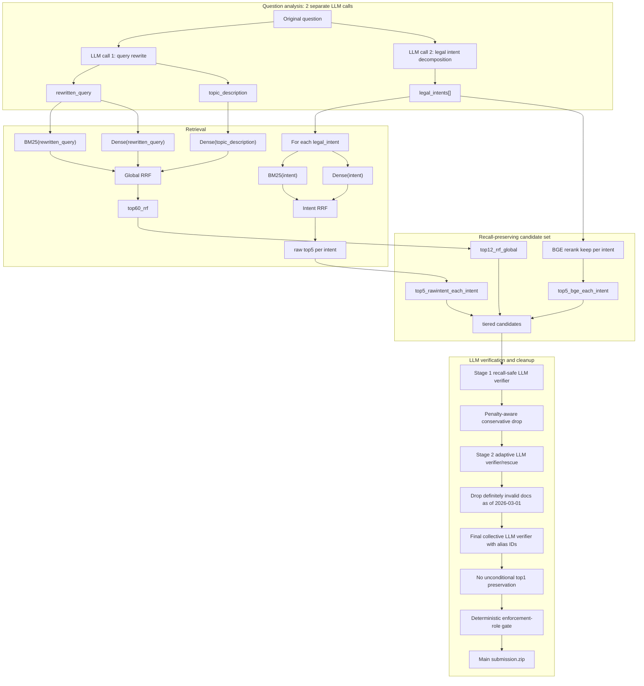

# Best Submission Workflow

Tai lieu nay ghi lai workflow dang chon lam nhanh chinh de tiep tuc toi uu submission article retrieval.

## Current Operational Best

Ban dang duoc chon lam workflow chinh:

```text
outputs/submission_final_no_top1_enforcement_role_gate/submission.zip
```

Leaderboard:

```text
ARTICLES_PRECISION = 0.5955
ARTICLES_RECALL    = 0.7800
```

Workflow chinh khong preserve top1 va dung sau enforcement-role gate. Coverage cluster LLM reducer
khong nam trong workflow mac dinh.

Ban coverage reducer co ca intent coverage guard va direct-title guard chi giu lam du phong:

```text
outputs/submission_coverage_cluster_reducer_full_c2200_w8/submission.zip
ARTICLES_PRECISION = 0.5968
ARTICLES_RECALL    = 0.7800
```

Ly do khong chon ban reducer lam nhanh chinh: muc tang precision rat nho trong khi them mot LLM stage,
them policy guard va tang rui ro generalization tren private test.

Quyet dinh hien tai:

```text
Main workflow:
outputs/submission_final_no_top1_enforcement_role_gate/submission.zip

Backup only:
outputs/submission_coverage_cluster_reducer_full_c2200_w8/submission.zip

Khong dua coverage cluster reducer vao flow mac dinh.
```

Benchmark cu de so sanh:

```text
outputs/submission_best_collective_filter_c2200_alias_preserve_top1_full_w12/submission.zip
ARTICLES_PRECISION = 0.6044
ARTICLES_RECALL    = 0.7853
```

Ly do chon workflow moi lam nhanh chinh:

```text
1. It hon 1 tang LLM verifier.
2. Van giu recall gan voi best cu.
3. De van hanh, debug va cai tien hon.
4. Cac buoc deterministic cleanup duoc dat dung cho de tranh rescue lai article sai hieu luc.
```

## High-Level Flow



## Important Ordering

### Penalty-Aware Drop

Penalty-aware conservative drop should run after Stage 1:

```text
Stage 1 recall-safe output
-> Penalty-aware conservative drop
```

Reason:

```text
Stage 1 has already removed obvious unrelated candidates, but still keeps many penalty/sanction articles.
Dropping penalty articles at this point improved Stage 1 precision without reducing recall.
```

Leaderboard effect:

```text
Stage 1 only:
ARTICLES_PRECISION = 0.3036
ARTICLES_RECALL    = 0.8300

Stage 1 + penalty-aware conservative:
ARTICLES_PRECISION = 0.3125
ARTICLES_RECALL    = 0.8300
```

Implementation output:

```text
outputs/submission_stage1_penalty_aware_drop_conservative/submission.zip
outputs/submission_stage1_penalty_aware_drop_conservative/diagnostics.json
```

### Drop Invalid Docs

Definitely invalid docs must be dropped after Stage 2 as well:

```text
Stage 2 adaptive output
-> Drop definitely invalid docs as of 2026-03-01
```

Reason:

```text
Stage 2 adaptive can rescue from evidence_order.
If candidate_article_ids is not cleaned, rescue can bring back invalid documents.
```

Observed bug:

```text
Stage 1 + penalty output invalid articles = 0
Stage 2 adaptive before final invalid articles = 26
```

Fix:

```text
1. Drop invalid docs from Stage 2 final_article_ids.
2. Set candidate_article_ids = final_article_ids in the cleaned diagnostics.
3. Use the cleaned diagnostics as input to final collective.
```

Cleaned Stage 2 output:

```text
outputs/submission_stage2_from_stage1_penalty_conservative_drop_invalid/submission.zip
ARTICLES_PRECISION = 0.4529
ARTICLES_RECALL    = 0.8033
```

## Score Timeline

| Stage | Output / Variant | Precision | Recall | Notes |
|---|---:|---:|---:|---|
| High-recall keep pool | `top60_rrf \| intent_hits` | ~0.035-0.037 | 0.9617 | Recall reservoir. |
| Tiered shortlist | `rrf12_bge5_rawintent5` | 0.1148 | 0.9083 | Chosen high-recall input for LLM. |
| Stage 1 old | `stage1 c1200/minfallback` | 0.3046 | 0.8267 | Old Stage 1. |
| Stage 1 alias/intents | `submission_stage1_alias_intents_b6_c1800_stage1only_full_w12` | 0.3036 | 0.8300 | Slightly higher recall, lower mean size. |
| Stage 1 + penalty | `submission_stage1_penalty_aware_drop_conservative` | 0.3125 | 0.8300 | Safe precision gain. |
| Stage 2 from Stage 1 + penalty | `submission_stage2_from_stage1_penalty_conservative_w12` | 0.4429 | 0.8033 | Had 26 invalid articles due rescue order. |
| Stage 2 + invalid drop | `submission_stage2_from_stage1_penalty_conservative_drop_invalid` | 0.4529 | 0.8033 | Invalid docs removed. |
| Final collective, no top1 | `submission_final_collective_no_preserve_top1` | 0.5855 | 0.7800 | Removing unconditional top1 improved precision without recall loss. |
| Current main workflow | `submission_final_no_top1_enforcement_role_gate` | 0.5955 | 0.7800 | Final collective without top1, then precise enforcement-role cleanup. |
| Backup experiment | `submission_coverage_cluster_reducer_full_c2200_w8` | 0.5968 | 0.7800 | Both coverage guards; not part of the default pipeline. |
| Benchmark old best | `submission_best_collective_filter_c2200_alias_preserve_top1_full_w12` | 0.6044 | 0.7853 | Stronger score, but one extra LLM stage. |

## Current Operational Best Stage Details

Input to final collective:

```text
outputs/submission_stage2_from_stage1_penalty_conservative_drop_invalid/diagnostics.json
```

Final collective settings:

```text
content_max_chars = 2200
batch_size        = 6
direct_max        = 8
workers           = 12
prompt_mode       = final_precision
preserve_top1     = false
strict_errors     = true
```

Important implementation choices:

```text
1. Use collective verification so the LLM compares candidate articles together.
2. Use alias IDs A1, A2, A3... instead of long article IDs.
3. Ask the LLM to return selected_article_keys.
4. Map selected_article_keys back to full article IDs in code.
5. Do not preserve top1 unconditionally; leaderboard showed it added noise without recall benefit.
6. Apply the enforcement-role gate after final collective.
7. Use strict error handling: do not cache fallback for LLM/parse errors; resume failed questions.
```

Final full-run diagnostics:

```text
rows             = 2000
min / max / mean = 1 / 14 / 2.8515 articles/question after enforcement-role gate
parse_or_skip    = 2000 / 2000
invalid remaining = 0
```

One special resume case:

```text
Question 1047 had 10 candidates and repeatedly failed in batch/global mode.
It was retried with direct_max=12 and workers=1, so it used one direct collective call.
```

## Reproduction

Run from `legal-ai/`.

### 1. Stage 1 + Penalty-Aware Conservative

```powershell
$env:PYTHONIOENCODING='utf-8'
.\.venv\Scripts\python.exe stage1_deterministic_cleanup.py `
  --input-diagnostics outputs/diagnostics_stage1_alias_intents_b6_c1800_stage1only_full_w12.json `
  --corpus corpus/data/corpus_clean_asof_20260301.json `
  --status-csv outputs/vbpl_full_corpus_status.csv `
  --output-dir outputs/submission_stage1_penalty_aware_drop_conservative
```

### 2. Stage 2 Adaptive

```powershell
$env:PYTHONIOENCODING='utf-8'
.\.venv\Scripts\python.exe llm_candidate_verifier.py `
  --config config_vertex_clean.yaml `
  --stage2-only-from-diagnostics outputs/submission_stage1_penalty_aware_drop_conservative/diagnostics.json `
  --corpus corpus/data/corpus_clean_asof_20260301.json `
  --intent-results outputs/intent_ranked_hits_clean_results.json `
  --cache cache/llm_stage2_from_stage1_penalty_conservative_w12.jsonl `
  --output-dir outputs/submission_stage2_from_stage1_penalty_conservative_w12 `
  --diagnostics outputs/diagnostics_stage2_from_stage1_penalty_conservative_w12.json `
  --workers 12 `
  --strict-errors
```

If interrupted or errors remain:

```powershell
  --resume
```

### 3. Drop Definitely Invalid Docs After Stage 2

```powershell
$env:PYTHONIOENCODING='utf-8'
.\.venv\Scripts\python.exe drop_invalid_from_diagnostics.py `
  --input-diagnostics outputs/diagnostics_stage2_from_stage1_penalty_conservative_w12.json `
  --status-csv outputs/vbpl_full_corpus_status.csv `
  --output-dir outputs/submission_stage2_from_stage1_penalty_conservative_drop_invalid
```

This script also resets:

```text
candidate_article_ids = final_article_ids
```

That prevents downstream rescue from reintroducing invalid documents.

### 4. Final Collective Without Preserve Top1

```powershell
$env:PYTHONIOENCODING='utf-8'
.\.venv\Scripts\python.exe llm_best_collective_filter.py `
  --config config_vertex_clean.yaml `
  --input-diagnostics outputs/submission_stage2_from_stage1_penalty_conservative_drop_invalid/diagnostics.json `
  --intent-results outputs/intent_ranked_hits_clean_results.json `
  --corpus corpus/data/corpus_clean_asof_20260301.json `
  --cache cache/llm_final_collective_from_stage2_penalty_drop_invalid_c2200_no_top1_w12.jsonl `
  --output-dir outputs/submission_final_collective_no_preserve_top1 `
  --diagnostics outputs/diagnostics_final_collective_from_stage2_penalty_drop_invalid_c2200_no_top1_w12.json `
  --content-max-chars 2200 `
  --batch-size 6 `
  --direct-max 8 `
  --workers 12 `
  --prompt-mode final_precision `
  --strict-errors
```

If interrupted or errors remain:

```powershell
  --resume
```

For question 1047 only, direct retry was needed:

```powershell
.\.venv\Scripts\python.exe llm_best_collective_filter.py `
  --config config_vertex_clean.yaml `
  --input-diagnostics outputs/submission_stage2_from_stage1_penalty_conservative_drop_invalid/diagnostics.json `
  --intent-results outputs/intent_ranked_hits_clean_results.json `
  --corpus corpus/data/corpus_clean_asof_20260301.json `
  --cache cache/llm_final_collective_from_stage2_penalty_drop_invalid_c2200_no_top1_w12.jsonl `
  --output-dir outputs/submission_final_collective_no_preserve_top1 `
  --diagnostics outputs/diagnostics_final_collective_from_stage2_penalty_drop_invalid_c2200_no_top1_w12.json `
  --content-max-chars 2200 `
  --batch-size 6 `
  --direct-max 12 `
  --workers 1 `
  --prompt-mode final_precision `
  --strict-errors `
  --resume
```

### 5. Enforcement-Role Gate

```powershell
$env:PYTHONIOENCODING='utf-8'
.\.venv\Scripts\python.exe enforcement_role_postprocess.py `
  --input outputs/submission_final_collective_no_preserve_top1/results.json `
  --corpus corpus/data/corpus_clean_asof_20260301.json `
  --output-dir outputs/submission_final_no_top1_enforcement_role_gate
```

## Output Files

```text
outputs/submission_final_collective_no_preserve_top1/results.json
outputs/submission_final_no_top1_enforcement_role_gate/audit.json
outputs/submission_final_no_top1_enforcement_role_gate/summary.json
outputs/submission_final_no_top1_enforcement_role_gate/submission.zip
```

## Negative Or Cautionary Experiments

Do not use these as default rules without retesting.

```text
Drop all amendment-like articles:
precision = 0.4949
recall    = 0.7850
Conclusion: harmful.
```

```text
Drop VBPL not found:
precision = 0.4547
recall    = 0.7150
Conclusion: clearly harmful.
```

```text
Broad Stage 2 collective replacement:
Smoke was not convincing.
Conclusion: Stage 2 adaptive is still the better middle stage.
```

## Current Interpretation

The system still has strong candidate recall:

```text
keep recall             ~= 0.9617
tiered pre-LLM recall   ~= 0.9083
current final recall     = 0.7800
current final precision  = 0.5955
```

Workflow dang chon gom ba tang LLM verifier co vai tro khac nhau:

```text
Stage 1 recall-aware compressor
-> penalty-aware conservative
-> Stage 2 adaptive
-> invalid-doc drop
-> final collective verifier
-> no unconditional top1 preservation
-> deterministic enforcement-role gate
```

## Next Optimization Priority: Stage 1

Stage 1 la diem can uu tien cai tien tiep theo vi day la noi recall giam manh nhat trong
toan bo chuoi verifier, dong thoi cung la noi nen candidate pool hieu qua nhat.

```text
Tiered input rrf12_bge5_rawintent5:
mean size ~= 17 articles/question
recall    ~= 0.9083

Stage 1 alias + intents:
mean size ~= 8 articles/question
recall    ~= 0.8300
```

Nhan dinh:

```text
Stage 1 da giam gan mot nua so article, nhung mat khoang 0.078 recall.
Muc tieu khong phai loc manh hon, ma giu muc nen gan hien tai trong khi tang recall sau Stage 1.
```

Vai tro dung cua Stage 1:

```text
1. La recall-aware compressor, khong phai final answer selector.
2. Chi drop article ro rang khong ho tro bat ky legal intent nao.
3. Giu article co the cung cap can cu truc tiep cho dieu kien, thu tuc, tham quyen,
   ngoai le, he qua phap ly hoac mot hop doc lap cua cau hoi.
4. Danh gia coverage theo tung legal intent de bao ve cau multi-hop.
5. Dung alias A1, A2... va output selected_article_keys de giam loi ID voi Gemma 3 12B.
6. Neu them coverage guard, guard chi bao ve evidence manh cho intent chua duoc cover;
   khong bu tiep khi evidence do da nam trong ket qua va khong ep du fixed K.
```

Muc tieu thu nghiem tiep theo:

```text
mean sau Stage 1: 8-10 articles/question
recall Stage 1:   0.86-0.88
```

Can phan tich cac article bi Stage 1 drop theo `legal_intent`, nguon retrieval va evidence rank
truoc khi sua prompt hoac guard. Khong them mot LLM stage moi chi de sua loi cua Stage 1.

Coverage reducer decision:

```text
Keep only as backup:
outputs/submission_coverage_cluster_reducer_full_c2200_w8/submission.zip

Rejected as default:
outputs/submission_coverage_cluster_reducer_intent_guard_only_c2200/submission.zip
Reason: leaderboard result was worse after removing direct-title guard.
```

Most promising next work:

```text
1. Cai tien Stage 1 de giu mean 8-10 nhung dua recall tu 0.83 len 0.86-0.88.
2. Phan tich false drop cua Stage 1 theo intent va evidence source truoc khi sua policy.
3. Giu preserve_top1 disabled trong final collective.
4. Giu invalid-doc drop sau moi stage co the rescue tu evidence_order cu.
5. Khong them coverage cluster reducer vao main workflow neu chua co cai thien dang ke.
```
