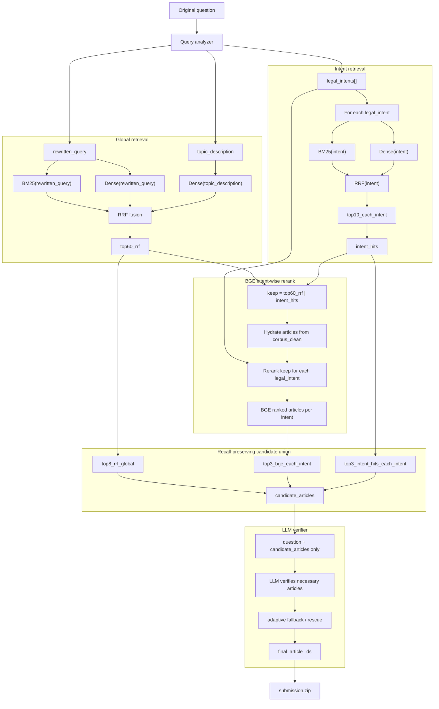

# RAG Workflow

Workflow hiện tại dùng `corpus_clean`, global RRF, intent retrieval, BGE
intent-wise rerank, rồi LLM verifier.



Core rules:

```text
Corpus source: corpus/data/corpus_clean.json
Qdrant collection: legal_vn_vertex_clean_v1
BM25 index: retrieval/data/bm25_index_clean_v1.pkl

keep = top60_rrf | intent_hits

candidate_articles =
    top8_rrf_global
  | top3_bge_each_intent
  | top3_intent_hits_each_intent

LLM verifier receives only question + candidate article content.
It does not receive retrieval scores, ranks, sources, rewritten_query, or intents.
```
