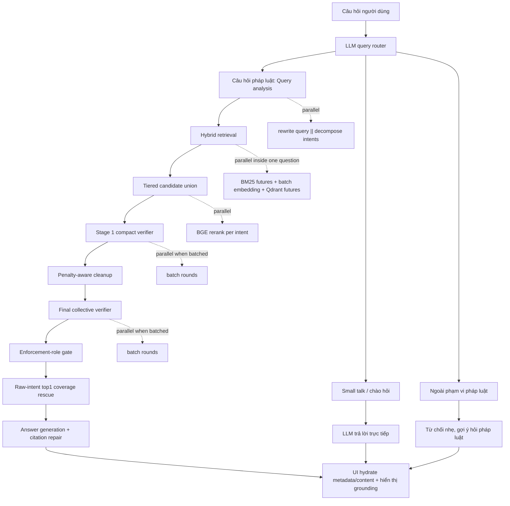
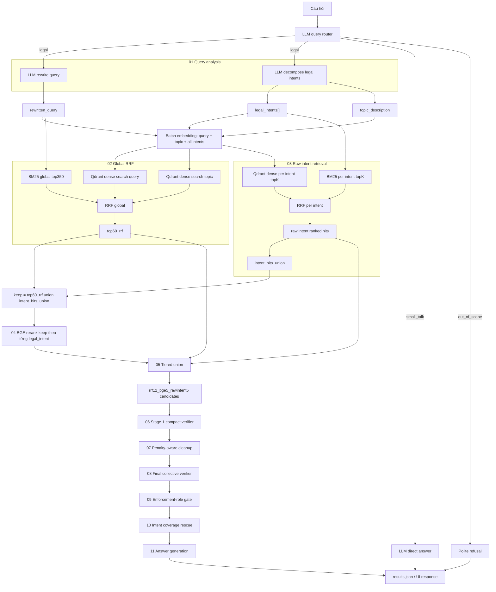
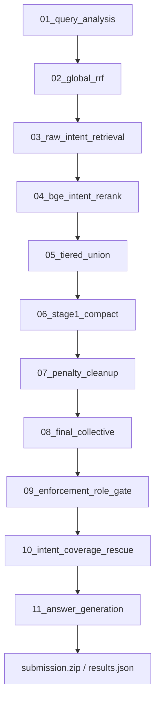

# RAG Workflow Hiện Tại

Tài liệu này mô tả workflow RAG đang dùng hiện tại cho cả production một câu và batch
submission. Corpus/index mặc định là bản đã làm sạch theo mốc hiệu lực `2026-03-01`:

- `corpus/data/corpus_clean_asof_20260301.json`
- `retrieval/data/bm25_index_asof_20260301.pkl`
- Qdrant collection/snapshot cùng corpus trên

## 1. Production Workflow Tổng Quản

Production UI/API dùng `SingleQuestionRagRunner`. Runner được tạo một lần khi service khởi
động để tái sử dụng BM25, Qdrant client, embedding client, BGE scorer, corpus lookup và LLM
clients.



## 2. Production Workflow Chi Tiết



## 3. Query Routing

Trước khi chạy RAG, production UI/API gọi một LLM router rất ngắn:

```text
User Query
├─ small_talk     -> LLM trả lời trực tiếp, không truy vấn vector/BM25
├─ legal          -> chạy đầy đủ RAG workflow
└─ out_of_scope   -> từ chối nhẹ và gợi ý hỏi câu pháp luật
```

Router dùng policy thận trọng: nếu lỗi model, parse JSON lỗi hoặc route không rõ ràng thì fallback
về `legal` để tránh bỏ sót câu hỏi pháp luật. Chỉ khi router trả chắc chắn `small_talk` hoặc
`out_of_scope` thì hệ thống mới bỏ qua RAG.

Các câu không chạy RAG sẽ không hiển thị phần `Nguồn văn bản` và `Căn cứ pháp lý`, vì không có
legal grounding từ corpus.

## 4. Candidate Selection Hiện Tại

Sau global RRF và raw intent retrieval:

```text
keep = top60_rrf ∪ intent_hits_union
```

`keep` chỉ là pool ứng viên để rerank/nén, không submit trực tiếp.

Tiered candidate union hiện dùng:

```text
topB_rrf_global = 12
topN_bge_each_intent = 5
topM_rawintent_each_intent = 5
```

Tên shorthand:

```text
rrf12_bge5_rawintent5
```

Mục tiêu của bước này là giảm số article trước LLM verifier nhưng vẫn giữ recall đủ cao.

## 5. LLM Verification Và Cleanup

### Stage 1 compact verifier

- Input: candidate articles từ `rrf12_bge5_rawintent5`.
- Article format: compact, phù hợp Gemma/Gemini endpoint.
- Content window: khoảng `1800` ký tự/article.
- Batch size: `6`.
- Mục tiêu: lọc nhiều nhiễu nhưng ưu tiên giữ recall.
- Có thể chạy song song theo batch round trong production.

### Penalty-aware cleanup

- Deterministic cleanup sau Stage 1.
- Drop một số article xử phạt/cưỡng chế khi câu hỏi không hỏi về xử phạt/cưỡng chế và có căn cứ khác phù hợp hơn.
- Nếu drop hết thì fallback giữ lại danh sách ban đầu để tránh rỗng.

### Final collective verifier

- Input: kết quả sau penalty cleanup.
- Content window: khoảng `2200` ký tự/article.
- Batch size: `6`.
- `direct_max = 8`, `min_size = 2`.
- `preserve_top1 = False` trong best flow hiện tại.
- Mục tiêu: lọc chính xác hơn ở mức toàn cục, ưu tiên precision hơn Stage 1.
- Có thể chạy song song theo batch round trong production.

### Enforcement-role gate

- Deterministic gate sau final collective.
- Loại article xử phạt/cưỡng chế còn sót nếu vai trò pháp lý không phù hợp câu hỏi.
- Không drop đến mức làm rỗng output.

### Raw-intent top1 coverage rescue

- Rescue dựa trên raw intent ranked hits.
- Mục tiêu: khôi phục một số căn cứ top theo intent bị final verifier loại nhầm.
- `rescue_coverage_depth` mặc định hiện tại: `4`.
- Các bản submission từng thử tốt nhất nằm trong family depth `2` và `4`; production default dùng `4`.

## 6. Answer Generation

Sau khi có final article list:

```text
question + final articles -> answer generation
```

Generation hiện có citation validator/repair nhẹ:

1. Generate answer lần đầu.
2. Kiểm tra các citation rõ ràng không thuộc supplied articles.
3. Nếu có lỗi citation rõ ràng, repair một lần.
4. Dù repair vẫn còn warning, hệ thống vẫn ghi output hoàn chỉnh thay vì block submission/UI.

UI sau đó hydrate metadata/content từ corpus local để hiển thị:

- câu trả lời;
- nguồn văn bản;
- danh sách điều luật liên quan;
- popup xem đầy đủ nội dung điều luật;
- citation highlight/click trong phần answer nếu map được về article đầu vào.

## 7. Các Phần Chạy Song Song

Trong production một câu:

1. `Query routing`: chạy trước RAG, là một LLM call ngắn.
2. `Query analysis`: rewrite và decompose chạy song song nếu route là `legal`.
3. `Retrieval`:
   - BM25 global chạy bằng future.
   - BM25 per intent chạy bằng futures.
   - Embedding được batch chung: `rewritten_query + topic_description + legal_intents`.
   - Sau khi có vector, Qdrant search query/topic/intents chạy bằng futures.
4. `BGE rerank`: rerank theo từng intent, số worker không vượt số intent.
5. `Stage 1 compact verifier`: batch rounds có thể chạy song song.
6. `Final collective verifier`: batch rounds có thể chạy song song.

Các phần song song chỉ giảm latency, không đổi query text, model, topK hay selection logic.

## 8. Các Phần Chạy Tuần Tự

1. Phải có `query routing` trước khi quyết định chạy RAG.
2. Phải có `query analysis` trước retrieval nếu route là `legal`.
3. Phải có global/intent retrieval trước tiered union.
4. Phải có tiered union trước Stage 1.
5. `Penalty-aware cleanup`, `enforcement-role gate`, `intent coverage rescue` là deterministic và chạy tuần tự.
6. `Answer generation` là một call chính, có thể repair một lần nếu citation lỗi rõ ràng.

## 9. Batch Full Pipeline 2000 Câu

Batch runner `run_best_pipeline.py` chạy theo phase. Mỗi phase chạy xong toàn bộ 2000 câu
rồi mới sang phase tiếp theo:



Các stage dùng LLM/model có cache JSONL và resume. Nếu lỗi network/GPU/endpoint tạm thời,
chạy lại đúng command sẽ tiếp tục phần thiếu thay vì fallback bừa.

## 10. Tham Số Mặc Định Production

Trong `legal_rag/production/single_question_runner.py`:

```text
config: config_gpu_gemini_production.yaml
corpus: corpus/data/corpus_clean_asof_20260301.json
bm25: retrieval/data/bm25_index_asof_20260301.pkl
expected_articles: 82570
global top60_rrf
dense/bm25 global topK tối thiểu: 350
tiered union: rrf12_bge5_rawintent5
Stage 1: 1800 chars/article, batch=6
Final collective: 2200 chars/article, batch=6, direct_max=8, min_size=2
preserve_top1: False
rescue_coverage_depth: 4
```

## 11. Ghi Chú Chất Lượng

- Corpus hiện đã lọc hiệu lực theo mốc `2026-03-01`, nên workflow không còn cần một bước
  drop invalid-doc riêng ở runtime.
- Các bước deterministic cleanup/gate/rescue không gọi LLM.
- LLM verifier vẫn là nút thắt chính giữa recall và precision.
- UI không thay đổi logic RAG; UI chỉ hydrate và trình bày grounding pháp lý.
