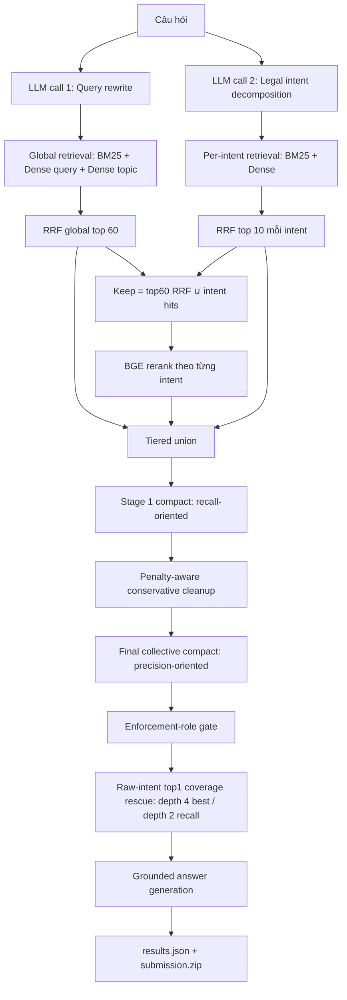

# RAG Workflow Hiện Tại

Workflow hiện tại dùng hai tầng LLM verifier, tối ưu riêng cho Gemma 3 12B-it.
Stage 2 cũ đã được loại bỏ hoàn toàn.



## 1. Query Analysis

Query analysis gồm hai LLM call độc lập:

1. Query rewrite sinh `rewritten_query` và `topic_description`.
2. Legal intent decomposition sinh các legal intent độc lập.

Các call lỗi hoặc parse lỗi không được ghi fallback vào cache. Pipeline để lại câu
lỗi và chạy lại bằng resume.

## 2. Global Và Intent Retrieval

Global retrieval:

```text
BM25(rewritten_query), top 350
Dense(rewritten_query), top 350
Dense(topic_description), top 350
-> RRF
-> top60_rrf
```

Intent retrieval cho từng intent:

```text
BM25(intent), top 50
Dense(intent), top 50
-> RRF
-> top10_each_intent
```

Keep reservoir:

```text
keep = top60_rrf | intent_hits
```

## 3. BGE Và Tiered Union

BGE rerank toàn bộ keep theo từng legal intent. Candidate đưa sang verifier là
union không cap cứng:

```text
top12_rrf_global
| top5_bge_each_intent
| top5_raw_intent_each_intent
```

Artifact phase 05:

```text
submissions/tiered_rrf12_bge5_rawintent5/submission.zip
```

## 4. Stage 1 Compact Verifier

Vai trò: nén mạnh candidate pool nhưng vẫn ưu tiên recall.

```text
model              = Gemma 3 12B-it
candidate format   = compact alias A1, A2, ...
content            = tối đa 1.800 ký tự/article
batch size         = 6 articles/call
temperature        = 0
strict errors      = true
prompt version     = gemma-recall-v4
```

Mỗi batch được đánh giá độc lập. Prompt không ép một batch phải cover tất cả
intent và cho phép trả danh sách rỗng nếu batch không có evidence. Article chỉ
cùng chủ đề nhưng không chứa quy định cụ thể phải bị loại. Nếu excerpt bị thiếu
nhưng có khả năng chứa evidence cần thiết thì giữ để bảo vệ recall.

Không có vòng global ở Stage 1 vì vòng này dễ làm mất evidence vừa được giữ từ
các batch khác. Output giữ thứ tự evidence ban đầu.

Nếu model trả JSON sai schema, hệ thống gọi một JSON-repair giới hạn chỉ để chuẩn
hóa selection đã có. Repair không được chọn lại article. Nếu vẫn lỗi, question
không được cache và phải chạy resume.

Artifact mới:

```text
cache/stage1_gemma_compact_v4.jsonl
submissions/stage1_gemma_compact_v4/submission.zip
```

Prompt này thay thế prompt cũ khiến Gemma giữ khoảng 71,6% candidate. Kết quả mới
chưa được benchmark vì workflow chưa được chạy lại.

## 5. Penalty-Aware Cleanup

Sau Stage 1, deterministic cleanup chỉ loại article xử phạt/cưỡng chế rõ ràng khi
question không hỏi chế tài và đã có evidence nghiệp vụ thay thế. Rule không drop
rộng chỉ dựa trên keyword.

Hiệu lực văn bản đã được xử lý trong corpus as-of nên phase này chạy với
`--skip-invalid`.

## 6. Final Collective Compact Verifier

Vai trò: so sánh toàn bộ shortlist và ưu tiên precision.

```text
model              = Gemma 3 12B-it
candidate format   = compact alias A1, A2, ...
content            = tối đa 2.200 ký tự/article
batch size         = 6
direct max         = 8
minimum input size = 2
preserve top1      = false
temperature        = 0
strict errors      = true
prompt version     = gemma-precision-v5
```

Chiến lược call:

- Dưới 2 article: giữ nguyên, không gọi LLM.
- Từ 2 đến 8 article: một collective call để so sánh trực tiếp.
- Trên 8 article: chia batch 6, union shortlist của các batch, sau đó gọi một
  global collective round để khử nhiễu và trùng lặp giữa batch.

Final chỉ giữ tập nhỏ nhất nhưng đủ cover mọi legal intent. Article chỉ cùng chủ
đề, sai subtask, meta chung, lặp cùng vai trò hoặc điều xử phạt không được hỏi sẽ
bị loại. Các article bổ sung quy tắc pháp lý khác nhau vẫn được giữ.

Một selection rỗng hợp lệ được bảo vệ bằng top1 evidence. Lỗi request/parse trong
strict mode không fallback và không cache. Final cũng dùng JSON repair giống
Stage 1.

## 7. Enforcement-Role Gate

Gate hậu xử lý chỉ loại điều xử phạt/cưỡng chế khi vai trò đó rõ ràng không phù
hợp câu hỏi. Đây là rule hẹp, không phải bộ lọc relevance tổng quát.

## 8. Raw-Intent Top1 Coverage Rescue

Sau `09_enforcement_role_gate`, pipeline áp dụng một post-process deterministic để khôi phục
coverage bị Final verifier loại quá tay. Đây là phase `10_intent_coverage_rescue` và được tích
hợp mặc định trong full pipeline.

Với từng legal intent:

1. Xét article raw-intent rank 1.
2. Bỏ qua nếu final còn ít nhất một article thuộc raw-intent top `coverage_depth` của intent đó.
3. Chỉ rescue nếu article rank 1 đã sống sót qua Stage 1 và penalty cleanup.
4. Giữ nguyên thứ tự final, append article rescue theo thứ tự intent và không thêm trùng.

Kết quả leaderboard xác nhận hai cấu hình tốt nhất:

| Version | Article P | Article R | Article F2 macro | Docs P | Docs R | Docs F2 macro | Mean article |
|---|---:|---:|---:|---:|---:|---:|---:|
| Depth 2, ưu tiên article recall | 0.4794 | **0.7577** | **0.6425** | 0.5223 | 0.7867 | 0.6864 | 3.7485 |
| Depth 4, best tổng thể/production | **0.4805** | 0.7510 | 0.6411 | **0.5367** | 0.7867 | **0.6928** | 3.6515 |

Depth 4 là bản best mặc định vì cân bằng tốt nhất giữa article và document. Depth 2 được giữ
làm biến thể ưu tiên article recall và Article F2. Depth 1 bị loại vì không tăng recall so với
depth 2 nhưng làm precision giảm; depth 3 bị depth 4 áp đảo.

Artifact:

```text
submissions/best_final_enforcement_gate_rawintent_top1_rescue_depth4/submission.zip
submissions/best_final_enforcement_gate_rawintent_top1_rescue_depth4/diagnostics.json
submissions/best_final_enforcement_gate_rawintent_top1_rescue_depth2/submission.zip
submissions/best_final_enforcement_gate_rawintent_top1_rescue_depth2/diagnostics.json
```

Depth 4 thay đổi 212/2.000 question và rescue 235 article. Depth 2 thay đổi 382 question và
rescue 429 article. Cả hai đều rebuild `relevant_docs` từ toàn bộ `relevant_articles`, nên không
có trường hợp article được rescue nhưng thiếu document tương ứng.

Đây là phase `10_intent_coverage_rescue` sau `09_enforcement_role_gate`. Pipeline mặc định dùng
depth 4; có thể chọn depth 2 bằng `--rescue-coverage-depth 2`. Rescue luôn chạy trước answer
generation để câu trả lời nhận đúng tập article cuối cùng.

## 9. Answer Generation

Generation nhận toàn bộ article sau gate và coverage rescue. Mỗi article dùng tối đa 2.400 ký tự;
article dài lấy excerpt theo formatter hiện tại và tổng content budget là 48.000
ký tự. Prompt yêu cầu câu trả lời tiếng Việt, grounded vào article đã chọn và
không chuyển điều kiện/hệ quả giữa các khoản, điểm lân cận.

Mỗi citation đầy đủ được chuẩn hóa và kiểm tra theo cặp `(Điều, law_id)` thuộc article đầu vào.
Hệ thống chỉ gọi repair một lần khi phát hiện citation hallucination rõ ràng: answer dẫn trực tiếp
một cặp điều-văn bản không có trong evidence đầu vào và không thể giải thích bằng cross-reference
hoặc metadata của evidence. Kết quả repair được chấp nhận và ghi cache; validator chỉ ghi cảnh báo,
không chặn `results.json`. Nếu request lỗi hoặc repair trả response rỗng, question không được cache
và sẽ được xử lý lại khi resume.

## 10. Phase Hiện Tại

| Phase | Nội dung |
|---|---|
| `01_query_analysis` | Rewrite + intent decomposition |
| `02_global_rrf` | Global retrieval/RRF |
| `03_raw_intent_retrieval` | Per-intent BM25 + Dense + RRF |
| `04_bge_intent_rerank` | BGE theo intent |
| `05_tiered_union` | Recall-oriented union |
| `06_stage1_compact` | Gemma recall-oriented compact verifier |
| `07_penalty_cleanup` | Deterministic penalty cleanup |
| `08_final_collective` | Gemma precision-oriented compact verifier |
| `09_enforcement_role_gate` | Enforcement-role cleanup |
| `10_intent_coverage_rescue` | Raw-intent top1, depth 4 mặc định hoặc depth 2 ưu tiên recall |
| `11_answer_generation` | Grounded final answer từ kết quả sau rescue |

## 11. Resume Và Cache Safety

Mỗi phase phải đủ toàn bộ question mới được đánh dấu complete. Lỗi kỹ thuật hoặc
JSON không hợp lệ không được chuyển thành kết quả fallback. Chạy lại cùng command
và `--run-dir` để chỉ xử lý phần thiếu.

Khi chuyển một run cũ sang workflow hai verifier này, dùng một lần:

```text
--accept-code-change --accept-workflow-change
```

Nếu endpoint vừa redeploy, thêm `--accept-runtime-change`. Stage 1 dùng cache/path
v2 nên output cũ không bị tái sử dụng sau khi prompt thay đổi.
