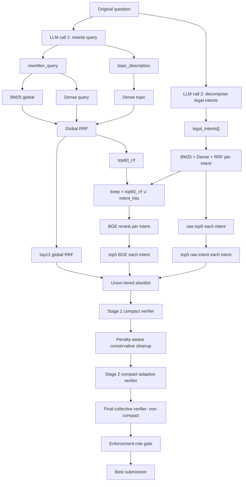

# Best RAG Workflow

Tài liệu này mô tả workflow tốt nhất hiện tại để tạo submission điều luật. Các số liệu
leaderboard bên dưới là kết quả đã đo, không phải metric local.

## Bản Chính Hiện Tại

```text
outputs/submission_final_from_stage2_compact_no_top1_enforcement_role_gate/submission.zip
```

```text
ARTICLES_PRECISION = 0.6377
ARTICLES_RECALL    = 0.8017
F2                 ≈ 0.7625
```

Phân bố output trên đủ 2.000 câu:

```text
min / max / mean = 1 / 14 / 2.9415 articles/question
empty questions  = 0
```

Đây là bản chính vì có F2 cao nhất. Bản Final compact được giữ làm phương án thiên về
precision, nhưng không thay thế bản chính:

```text
outputs/submission_final_compact_from_stage2_compact_no_top1_enforcement_role_gate/submission.zip

ARTICLES_PRECISION = 0.6429
ARTICLES_RECALL    = 0.7987
F2                 ≈ 0.7618
min / max / mean   = 1 / 15 / 3.0635
```

## Luồng End-to-End



## Chi Tiết Từng Giai Đoạn

### 1. Question Analyzer

Question Analyzer dùng hai lần gọi LLM độc lập:

1. Rewrite call sinh `rewritten_query` và `topic_description`.
2. Decompose call sinh `legal_intents[]`.

Không gộp hai nhiệm vụ vào cùng một call. Cách này giữ nguyên nhánh retrieval global đã
từng hoạt động tốt và chỉ bổ sung intent retrieval để tăng recall cho câu multi-hop.

### 2. Global Và Intent Retrieval

Global retrieval:

```text
BM25(rewritten_query, source_top_k=350)
Dense(rewritten_query, source_top_k=350)
Dense(topic_description, source_top_k=350)
-> RRF
-> top60_rrf
```

Intent retrieval chạy độc lập trên toàn bộ BM25/Qdrant collection:

```text
for each legal_intent:
    BM25(intent)
    Dense(intent)
    RRF(intent)
    raw top5 for this intent
```

Recall reservoir ban đầu:

```text
keep = top60_rrf | intent_hits
recall ≈ 0.9617
```

### 3. Tiered Candidate Shortlist

BGE rerank `keep` theo từng legal intent. Candidate đưa vào LLM là union không giới hạn
cap cứng:

```text
top12_rrf_global
| top5_bge_each_intent
| top5_rawintent_each_intent
```

Artifact:

```text
outputs/submission_bge_intent_tiered_rrf12_bge5_rawintent5_clean/results.json
```

Kết quả:

```text
precision = 0.1148
recall    = 0.9083
min / max / mean = 12 / 45 / 17.8215
```

Mục tiêu của bước này là giữ recall, chưa phải tạo output cuối.

### 4. Stage 1 Compact Verifier

Stage 1 là recall-aware compressor:

```text
batch_size        = 6 articles/call
content_max_chars = 1800/article
workers           = 12
input             = original question + legal_intents + compact candidates
output            = selected_article_keys: ["A1", "A3", ...]
```

Candidate compact:

```json
{
  "key": "A1",
  "source": "123/2020/NĐ-CP - Quy định về hóa đơn, chứng từ",
  "article": "Điều 15. Đăng ký sử dụng hóa đơn điện tử",
  "content": "..."
}
```

Artifact:

```text
outputs/submission_stage1_compact_only_b6_c1800_full_w12/results.json
```

Leaderboard và phân bố:

```text
precision = 0.3135
recall    = 0.8517
min / max / mean = 1 / 32 / 7.4585
```

Sau Stage 1, áp dụng penalty-aware conservative cleanup. Rule chỉ loại article xử phạt,
cưỡng chế rõ ràng không được question yêu cầu và có evidence nghiệp vụ thay thế; không
drop rộng chỉ dựa trên keyword.

```text
outputs/submission_stage1_compact_penalty_aware_drop_conservative/results.json
min / max / mean = 1 / 32 / 7.3520
```

### 5. Stage 2 Compact Adaptive Verifier

Stage 2 lọc lại output Stage 1 sau penalty cleanup:

```text
content_max_chars = 1600/article
compact aliases   = true
strict_errors     = true

1 article  -> skip LLM
2-10       -> one collective call
>10        -> batches of 8, union survivors, then one global collective call
```

Adaptive protection:

```text
semantic empty -> evidence top2
one selected   -> selected ∪ evidence top1
```

Nếu top evidence đã nằm trong kết quả thì không bù tiếp article dưới. Lỗi request hoặc
parse không được cache thành fallback; câu lỗi phải được chạy lại bằng `--resume`.

Không còn bước drop invalid sau Stage 2. Hiệu lực văn bản được xử lý upstream trong corpus:

```text
corpus/data/corpus_clean_asof_20260301.json
82,570 articles
5,473 law IDs
0 invalid law IDs at 2026-03-01
```

BM25 và Qdrant phải được build lại từ đúng corpus này. Khi toàn bộ retrieval universe đã
không chứa văn bản invalid, Stage 2 và các bước rescue phía sau không thể đưa chúng trở lại.

Artifact Stage 2:

```text
outputs/submission_stage2_compact_from_stage1_compact_penalty_full_w12/results.json
```

Benchmark dưới đây được đo từ lần chạy trước có post-process invalid. Sau khi rebuild BM25
và Qdrant từ corpus as-of, cần chạy lại để xác nhận metric của workflow mới:

```text
precision = 0.4814
recall    = 0.8250
min / max / mean = 1 / 26 / 5.2520
```

### 6. Final Collective Verifier

Bản chính dùng Final collective non-compact vì explicit metadata giúp so sánh article tốt
hơn ở vòng quyết định cuối:

```text
content_max_chars = 2200/article
batch_size        = 6
direct_max        = 8
workers           = 12
prompt_mode       = final_precision
preserve_top1     = false
strict_errors     = true
```

Routing:

```text
1-2 articles -> giữ nguyên, không gọi LLM
3-8 articles -> một collective call
>8 articles  -> batch 6, union survivors, rồi một global collective call
```

LLM chọn article cần thiết để trả lời đầy đủ question, có xét các legal intents. Không
preserve top1 vô điều kiện vì leaderboard cho thấy top1 rescue thêm noise mà không tăng
recall trong workflow này.

Artifact trước deterministic gate:

```text
outputs/submission_final_collective_from_stage2_compact_no_top1/results.json
min / max / mean = 1 / 14 / 2.9660
```

### 7. Enforcement-Role Gate

Gate cuối loại chính xác các article xử phạt/cưỡng chế không được question yêu cầu, nhưng
chỉ khi có alternative nghiệp vụ phù hợp. Không hard-drop mọi article có từ khóa xử phạt.

Trên 2.000 câu:

```text
changed questions = 38
removed articles  = 49
mean before       = 2.9660
mean after        = 2.9415
```

Output cuối:

```text
outputs/submission_final_from_stage2_compact_no_top1_enforcement_role_gate/results.json
outputs/submission_final_from_stage2_compact_no_top1_enforcement_role_gate/audit.json
outputs/submission_final_from_stage2_compact_no_top1_enforcement_role_gate/summary.json
outputs/submission_final_from_stage2_compact_no_top1_enforcement_role_gate/submission.zip
```

## Score Timeline

| Stage | Precision | Recall | Mean articles | Ghi chú |
|---|---:|---:|---:|---|
| Keep reservoir | ~0.035-0.037 | 0.9617 | ~64 | `top60_rrf \| intent_hits` |
| Tiered shortlist | 0.1148 | 0.9083 | 17.8215 | `rrf12_bge5_rawintent5` |
| Stage 1 compact | 0.3135 | 0.8517 | 7.4585 | Batch 6, content 1800 |
| Stage 1 + penalty cleanup | - | - | 7.3520 | Conservative deterministic cleanup |
| Stage 2 compact | 0.4814 | 0.8250 | 5.2520 | Benchmark cũ; corpus mới xử lý hiệu lực upstream |
| Final collective non-compact | - | - | 2.9660 | No preserve top1 |
| **Final + enforcement gate** | **0.6377** | **0.8017** | **2.9415** | **Current best** |
| Final compact + gate | 0.6429 | 0.7987 | 3.0635 | Precision backup, F2 thấp hơn |

## Quy Tắc Vận Hành

1. Build cả BM25 và Qdrant từ `corpus/data/corpus_clean_asof_20260301.json`.
2. Luôn hydrate article từ cùng corpus đó.
3. Dùng compact candidates ở Stage 1 và Stage 2; dùng non-compact ở Final chính.
4. Dùng alias `A1`, `A2`, ... và map về article ID trong code.
5. Không cache fallback khi LLM/request/JSON parse lỗi; resume đến khi đủ 2.000 câu.
6. Không thêm post-process drop invalid; hiệu lực đã được bảo đảm ở corpus/index layer.
7. Không preserve top1 ở Final collective.
8. Không thêm coverage reducer hoặc same-law reducer vào main flow; các thử nghiệm đó chưa
   cải thiện F2 đủ để bù rủi ro generalization.
9. Final submission phải có 2.000 question IDs duy nhất và không có output rỗng.

## Chạy Toàn Bộ Bằng Một Command

Sau khi Qdrant collection đã có đủ `82,570` points và các endpoint đã được cấu hình, chạy:

```powershell
$env:PYTHONIOENCODING='utf-8'
.\.venv\Scripts\python.exe run_best_pipeline.py `
  --config config_vertex_clean.yaml `
  --input ..\R2AIStage1DATA.json `
  --run-dir outputs\runs\best_asof_20260301_v1
```

Command này tự động chạy tuần tự toàn bộ workflow best. Chạy lại đúng command trên sẽ
resume từ cache và stage hoàn chỉnh gần nhất; không cần gọi từng script thủ công.

Chỉ kiểm tra setup mà chưa chạy 2.000 câu:

```powershell
.\.venv\Scripts\python.exe run_best_pipeline.py `
  --config config_vertex_clean.yaml `
  --input ..\R2AIStage1DATA.json `
  --run-dir outputs\runs\best_asof_20260301_v1 `
  --preflight-only
```

Preflight bắt buộc kiểm tra:

```text
2,000 unique question IDs
82,570 corpus articles
82,570 BM25 IDs matching corpus
82,570 Qdrant points and every expected chunk ID
Configured embedding/query rewrite endpoint (Gemini or Qwen3/Gemma)
BGE endpoint
input/corpus/BM25/config/runtime/code fingerprints
```

Preflight cũng từ chối collection có sai dimension/distance hoặc point cũ có
embedding backend, model hay embedding-text hash không khớp corpus/config hiện tại.
Một vector search thật được chạy trước khi bắt đầu xử lý 2.000 câu.

Artifacts của một run được cô lập tại:

```text
outputs/runs/best_asof_20260301_v1/
  manifest.json
  errors.jsonl
  cache/
  artifacts/
  logs/
  submissions/
```

Technical request/parse/network errors không tạo fallback record. Record lỗi không được
cache và sẽ được retry trong resume pass hoặc lần chạy command tiếp theo. Nếu vẫn thiếu
question sau số resume pass cho phép, orchestrator dừng với exit code khác 0 và không tạo
final submission giả.

Semantic rescue của Stage 2 vẫn được giữ vì đây là selection policy của workflow best,
không phải technical fallback:

```text
valid parsed empty selection -> evidence top2
valid parsed single selection -> union evidence top1
```

Final output:

```text
outputs/runs/best_asof_20260301_v1/submissions/
  best_final_enforcement_gate/results.json
  best_final_enforcement_gate/audit.json
  best_final_enforcement_gate/summary.json
  best_final_enforcement_gate/submission.zip
```

### GPU backend: Qwen3 + Gemma + shared BGE

GPU mode uses the same workflow and strict resume policy, with these model routes:

```text
query embedding / topic embedding / intent embedding -> Qwen3-Embedding-8B
query rewrite / legal-intent decomposition          -> Gemma 3 12B-it
Stage 1 / Stage 2 / Final collective verifier       -> Gemma 3 12B-it
intent-wise cross-encoder reranking                  -> shared BGE GPU endpoint
```

The Qwen collection is separate because Qwen3 produces 4096-dimensional vectors,
while the Gemini collection uses 3072 dimensions. Build the GPU collection once:

```powershell
.\.venv\Scripts\python.exe setup_qdrant_cloud.py `
  --config config_gpu_clean.yaml `
  --corpus corpus\data\corpus_clean_asof_20260301.json `
  --workers 4
```

Collection building is resumable and fail-closed. Every point stores the backend,
embedding model, and SHA-256 of the exact normalized embedding text. Existing points
are reused only when all three values match. Failed embedding/upsert batches are retried;
the command performs up to three indexing passes by default and succeeds only after the
collection schema, exact count, every chunk ID, and every embedding-text hash pass validation.

Then run all 2,000 questions with one command:

```powershell
$env:PYTHONIOENCODING='utf-8'
.\.venv\Scripts\python.exe run_best_pipeline.py `
  --config config_gpu_clean.yaml `
  --input ..\R2AIStage1DATA.json `
  --run-dir outputs\runs\best_gpu_asof_20260301_v1
```

Use the exact same command again to resume. GPU and Vertex runs must use different
`--run-dir` values; the manifest also fingerprints endpoint IDs, DNS names, models,
Qdrant target, corpus, BM25 index, config, and pipeline code.

## Hướng Cải Tiến Tiếp Theo

Stage 1 vẫn là điểm mất recall lớn nhất:

```text
Tiered recall = 0.9083
Stage 1 recall = 0.8517
```

Ưu tiên tiếp theo là phân tích false-drop theo intent và evidence source để giữ mean khoảng
7-9 articles nhưng nâng recall Stage 1. Không nên thêm một LLM stage mới chỉ để sửa lỗi của
Stage 1.
